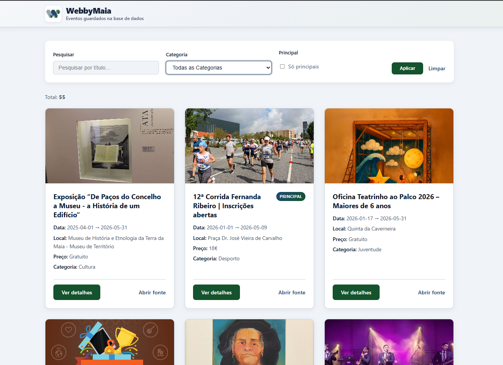

<p align="center">
  
</p>

<hr />

# WebbyMaia

« Um programinha que liga o calendário da Maia ao teu ecrã. »

---

## Para que serve este projeto

O **WebbyMaia** existe para uma coisa simples e útil: **juntar num só sítio os eventos públicos do Visit Maia** e guardá-los numa **base de dados (Supabase/PostgreSQL)**, já com campos limpos e prontos a consumir noutra aplicação, num *site*, num *bot* ou num painel.

Não substitui o sítio oficial: **respeita a fonte** e só organiza a informação para quem precisa de dados estruturados (estudantes, associações, *developers*, curiosos…).

---

## O que faz?

1. Vai buscar uma lista de URLs de eventos no sítio (sem *browser*), usando a **API do calendário** (`/api/aapillevents`).
2. Visita **cada página de evento** (uma vez por URL, para não repetir trabalho).
3. Extrai `titulo`, `url_evento`, `datas`, `local`, `preco`, `descricao`, `imagem_url` (com heurística para escolher a **imagem certa** do evento — ver documentação).
4. Atribui **categoria** com `rules_cate.py` (palavras-chave, desempates e ***overrides*** por título quando necessário).
5. Marca `is_principal=True` se o evento aparecer na agenda anual (`main_events_agenda.json`).
6. Faz ***upsert*** no Supabase (cria ou atualiza pelo `url_evento` UNIQUE).
7. Faz **auto-limpeza** na base de dados: remove eventos cuja **`data_inicio`** é anterior ao **primeiro dia do mês corrente menos quatro meses** (exemplo: em **julho** removem-se eventos que começam antes de **1 de março** — **janeiro** e **fevereiro** saem, entre outros mais antigos).
8. Recolhe as **5 notícias** mais recentes do sítio da **Câmara Municipal da Maia**, categoriza com `rules_news_cate.py` e **sincroniza** a tabela `noticias` (só ficam na base as cinco URLs atuais).

Além disso, o projeto inclui uma **interface web** em Flask (`web/`) que lê o Supabase: listagem de eventos com filtros, **18 eventos por página**, paginação compacta (`<` · `1/N` · `>`), página de detalhe do evento e página **Notícias** com até **cinco** artigos.

É, na prática, uma **ponte** entre o calendário do Visit Maia (e a atualidade da CM Maia) e o formato que as máquinas adoram: chaves, listas e datas ISO — com opção de ver tudo num *browser*.

---

## Atualizações recentes (resumo)

- **Eventos:** janela de *scrape* **quatro meses à frente** (meses de calendário); limpeza por **`data_inicio`**, não por `data_extracao`.
- **Notícias:** tabela `noticias`, *scraper* em `scraper/news/`, sincronização das **5** últimas na base e na web.
- **Imagens:** *parser* a pontuar candidatos no HTML (evita `og:image` ou primeira `` erradas entre eventos).
- **Categorias:** Institucional mais restrito nos eventos; desempate; *overrides* por título para casos limite.
- **Web:** tema cinzento-azulado / azul escuro / verde escuro, *layout* responsivo, *logo* em `web/static/webby.png`, navegação Eventos / Notícias.
- **Documentação:** [`documentation/webbyDoc.md`](documentation/webbyDoc.md) (*backend* / base de dados), [`documentation/webbyWebDoc.md`](documentation/webbyWebDoc.md) (*frontend*).

---

## Interface web (espaço para captura de ecrã)


<p align="center">
  
</p>

**Correr a interface:** `python -m web.app` (requer `.env` com Supabase; ver a secção de variáveis de ambiente).

---

## Ficheiros principais

| Ficheiro / pasta | Papel |
|------------------|-------|
| `main.py` | Script principal (Railway Cron Job): eventos → filtra → *upsert* → limpa; notícias → sincroniza |
| `scraper/` | *Scraping* sem *browser* (`httpx` + `BeautifulSoup`) |
| `scraper/news/` | Listagem de notícias da CM Maia (até 5) |
| `db/supabase_client.py` | Cliente Supabase: *upsert*, limpeza, leitura para a web |
| `rules_cate.py` | Categorização de eventos (regras, desempates, *overrides* por título) |
| `rules_news_cate.py` | Categorização de notícias |
| `web/` | Aplicação Flask: eventos, notícias, detalhe |
| `schema/events.sql`, `schema/news.sql` | Esquemas das tabelas no Supabase |
| `main_events_agenda.json` | Agenda “principal” para marcar `is_principal=True` |

---

## Requisitos

- Python 3.x
- `httpx`, `beautifulsoup4`, `lxml`, `supabase`, `python-dotenv`, `flask`, `gunicorn` (ver `requirements.txt`)

---

## Como correr

Na pasta do projeto:

```bash
python -m venv .venv
# Windows PowerShell:
.\.venv\Scripts\Activate.ps1
pip install -r requirements.txt
python main.py
```

Para **só ver os dados no *browser*** (lê o Supabase):

```bash
python -m web.app
```

O script `main.py` imprime *logs* do género:

- `URLs recolhidos (calendário/API): N`
- `Janela de datas: AAAA-MM-DD -> AAAA-MM-DD` (cerca de quatro meses de calendário à frente)
- `Upsert concluído. Eventos enviados: N`
- `Auto-limpeza concluída. Eventos apagados: X`
- `--- Notícias CM Maia ---` e `Notícias sincronizadas: …`

Se ainda não houver variáveis do Supabase, ele faz ***dry-run*** nos eventos (extrai dados e termina, sem gravar) e o mesmo pode acontecer no bloco das notícias. A aplicação web **precisa** do Supabase configurado para listar dados.

---

## Variáveis de ambiente (segurança)

Cria um ficheiro `.env` (não comites; já está no `.gitignore`) com:

```env
SUPABASE_URL=https://<teu-projeto>.supabase.co
SUPABASE_SERVICE_ROLE_KEY=<a-tua-service-role-key>
MAX_URLS=80
```

- `SUPABASE_SERVICE_ROLE_KEY`: usa **Service Role** porque isto corre no *backend* (Railway). Nunca usar esta chave em *frontend*.
- `MAX_URLS` é opcional: serve para limitar quantos eventos se processam e manter custos baixos.

---

## Janela de *scrape* e retenção (eventos)

- O script **não** tenta procurar eventos passados para ingestão na janela atual.
- Guarda eventos **de hoje até quatro meses à frente** (soma de meses de calendário, ver `add_calendar_months` na documentação do *backend*).
- **Auto-limpeza:** apaga eventos com `data_inicio` **anterior** ao primeiro dia do mês “hoje − 4 meses” (contado a partir do dia 1 do mês corrente). Ver exemplo no início deste README (julho / março / janeiro–fevereiro).

As **notícias** não usam esta regra: mantêm-se sempre as **cinco** URLs mais recentes da listagem, substituindo o conjunto anterior na base de dados.

---

## Regras do campo `preco` (eventos)

O sítio às vezes mostra preços como texto longo ou várias opções. Para manter a base de dados limpa, gravamos:

- Se o texto contiver **“Gratuito”** → `Gratuito`
- Se o texto contiver **“Sob consulta”** → `Sob Consulta`
- Se tiver **1 valor em €** → `X€` (ex.: `30€`)
- Se tiver **vários valores em €** → `Desde X€` (usa o menor, ex.: `Desde 5€`)
- Se não houver nenhum valor claro em € → `Sob Consulta`

---

## *Deploy* no Railway (Cron Job)

1. Liga o projeto ao GitHub no Railway.
2. Em **Variables**, adiciona:
   - `SUPABASE_URL`
   - `SUPABASE_SERVICE_ROLE_KEY`
   - (opcional) `MAX_URLS`
3. Em **Start Command**, usa: `python main.py`
4. Em **Settings → Cron Schedule**, usa por exemplo:
   - `0 6 * * *` (todos os dias às 06:00 UTC)
5. Confirma nos *logs* que aparece:
   - `Upsert concluído...`
   - `Auto-limpeza concluída...`
   - `Notícias sincronizadas...`

---

## Sobre a *logo*

O logótipo foi desenhado por mim (Robim) utilizando o [Canva](https://www.canva.com/). O ficheiro fonte está em `assets/webby.png`; para a interface Flask usa-se também uma cópia em `web/static/webby.png` (servida como ficheiro estático).

O conceito principal é um "W" de Webby, construído com a paleta de cores que melhor caracteriza a cidade da Maia:

- **Verde:** Inspirado na natureza local, como os emblemáticos parques, os jardins e a biodiversidade da cidade.
- **Azul e Cinzento:** Refletem a vertente urbana e digital. Representam tanto a arquitetura local (como o centro da Maia e a Torre do Lidador) como a identidade online e tecnológica do município.
---

## Nota importante

*Web scraping* depende do *layout* do sítio: se o Visit Maia ou a CM Maia mudarem o HTML, pode ser preciso ajustar selectores em `scraper/parse.py` ou `scraper/news/parse.py`. Usa os dados com bom senso e **em linha com os termos do sítio** que estás a ler.

---

<p align="center">
  <small>— WebbyMaia — eventos e notícias, com meses de calendário —</small>
</p>
